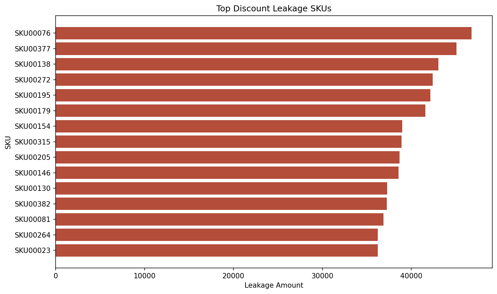
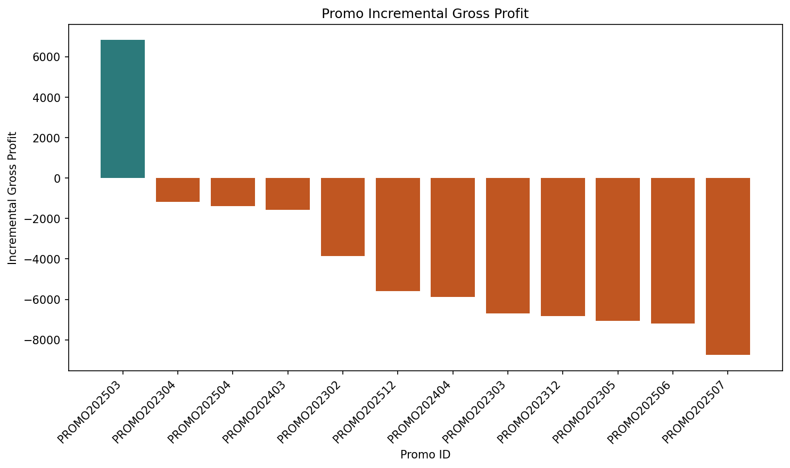
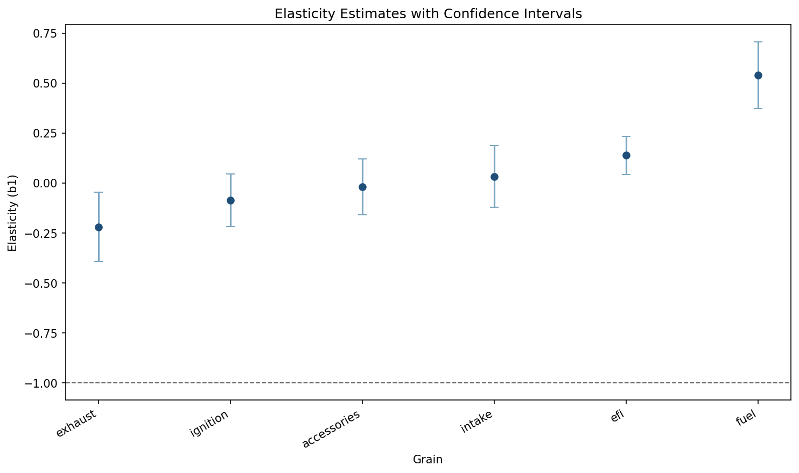
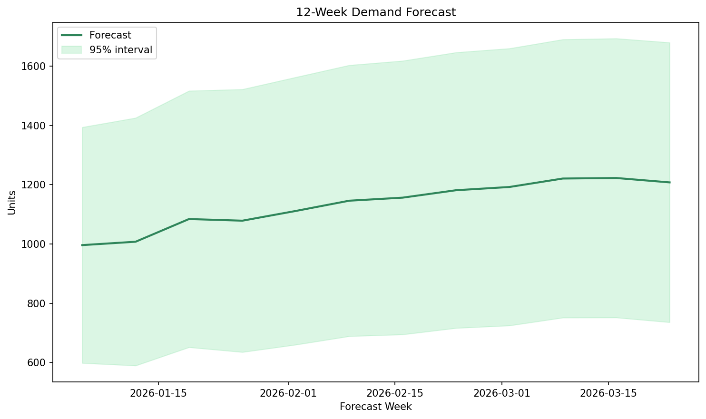
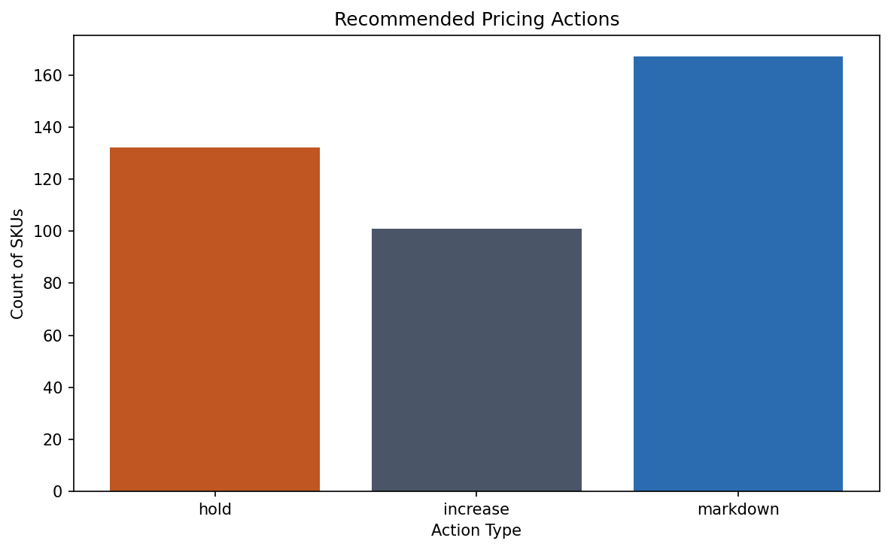

# Pricing Strategy Memo

## Objectives and scope
- Build a pricing analytics workflow using synthetic ERP-style sales, inventory, customer, product, and competitor pricing data
- Quantify pricing realization, margin performance, promotion impact, elasticity, and inventory-based pricing actions
- Produce decision-ready outputs for Power BI and a pricing recommendation memo
- Data in this memo is synthetic unless otherwise stated

## Figures included
- `figures/top_discount_leakage_skus.png`
- `figures/promo_incremental_gross_profit.png`
- `figures/elasticity_estimates_ci.png`
- `figures/forecast_12_weeks.png`
- `figures/recommended_actions_counts.png`

## Current state
Pricing realization and margin diagnostics are generated from the pipeline outputs.

Top discount leakage is concentrated in a small set of SKUs. The top 10 leakage SKUs account for approximately `$416,207` in discount leakage, with average gross margin of `36.33%` across those SKUs.

Priority leakage SKUs (current run):
- `SKU00076`: `$46,765` leakage
- `SKU00377`: `$45,095` leakage
- `SKU00138`: `$43,048` leakage
- `SKU00272`: `$42,408` leakage
- `SKU00195`: `$42,158` leakage

## Key findings
Pipeline outputs identify measurable performance differences across promotions and pricing responsiveness by category/product family.

Promo performance is uneven. Several promotions add gross profit, while multiple promotions are margin-destructive after accounting for discounting.

Highest and lowest observed promo outcomes (current run):
- Best observed promotion: `PROMO202503` with approximately `$6,823` incremental gross profit
- Most margin-destructive promotions include `PROMO202408` (`$-24,473`), `PROMO202308` (`$-22,442`), and `PROMO202508` (`$-21,001`)

Elasticity estimates provide a quantitative basis for scenario design and guardrails. The average modeled elasticity is `0.06` in the current run, with `exhaust` the most elastic group (`-0.22`) and `fuel` the least elastic group (`0.54`).

Confidence intervals should be reviewed before applying large price moves.

## Recommendations
Recommendations combine elasticity-aware pricing scenarios and inventory-driven pricing actions.

Use the forecast to stage pricing and promotion decisions over the next 8 to 12 weeks, with higher caution when forecast uncertainty widens.

Current forecast summary:
- Average projected volume over the next 12 weeks is approximately `1,134` units per week
- Forecast trend from first to last projected week is `21.23%`

Use the recommended action list to prioritize markdowns for overstock and end-of-life items while preserving contribution margin floors.

Current action mix:
- `167` markdown actions
- `132` hold actions
- `101` increase actions
- Median days of supply for markdown recommendations is `182.8` days

Suggested recommendation structure:
- Price governance actions for top leakage SKUs (discount exception review and guardrail tightening)
- Promotion changes for margin-destructive promo IDs (pause, redesign, or narrower targeting)
- Category-level price tests guided by elasticity bands and confidence intervals
- Inventory markdown actions filtered by lifecycle stage and contribution margin floors
- Pilot scenario test based on top projected gross profit case: `plus_5_pct_selected_categories` (`13.55%` projected gross profit change, `4.88%` projected revenue change)

## Risks and next steps
- Data is synthetic unless otherwise stated
- Forecast and elasticity outputs are lightweight models and should be validated against alternative specifications
- Competitor pricing is simulated unless a compliant real snapshot pipeline is added
- Next steps include Power BI page buildout and stakeholder-ready recommendation sequencing
