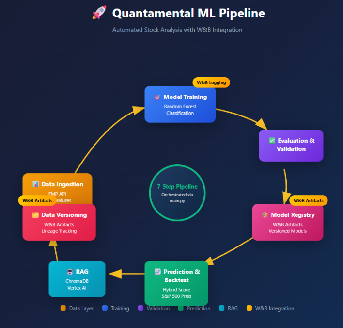
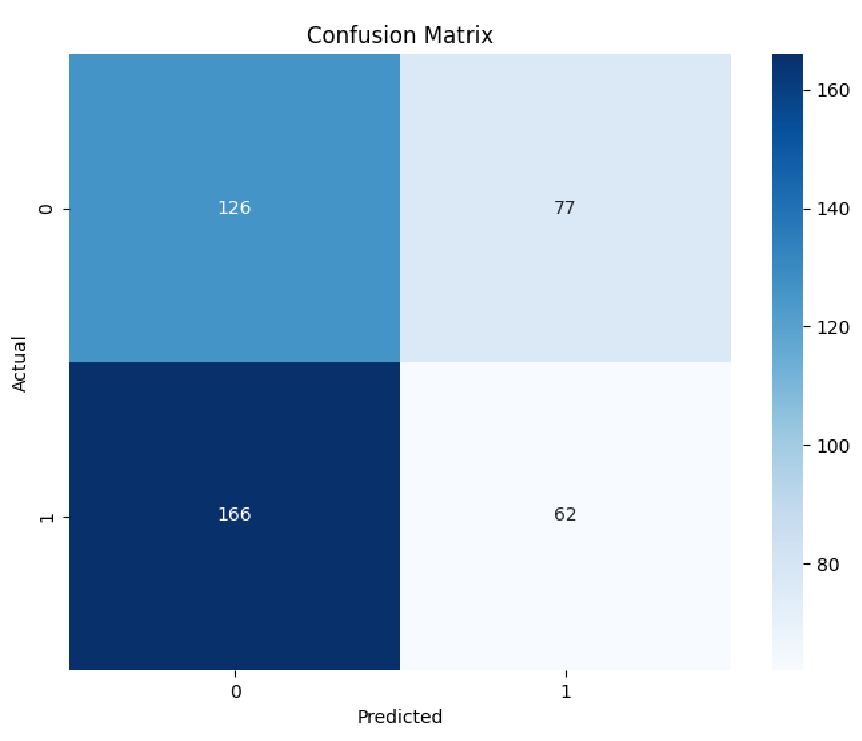

# Quantamental Stock Analysis Model - Complete Documentation

**CSCI-E 115 / AC215 - Milestone 4**  
**Team: Stock Busters**  
**Author: Sirisom Pranivong**  
**Date: November 2025**

---

## Table of Contents

1. [Executive Summary](#1-executive-summary)
2. [Pipeline Architecture](#2-pipeline-architecture)
3. [Data Collection](#3-data-collection)
4. [Feature Engineering](#4-feature-engineering)
5. [Model Training](#5-model-training)
6. [Model Validation](#6-model-validation)
7. [Model Evaluation](#7-model-evaluation)
8. [Prediction & Backtesting](#8-prediction--backtesting)
9. [RAG Integration](#9-rag-integration)
10. [Data Versioning](#10-data-versioning)
11. [Experiment Tracking](#11-experiment-tracking)
12. [CI Pipeline](#12-ci-pipeline)
13. [Deployment Strategy](#13-deployment-strategy)
14. [Known Limitations & Future Improvements](#14-known-limitations--future-improvements)

---

## 1. Executive Summary

### 1.1 Project Overview

The Quantamental Stock Analysis Model is a machine learning pipeline that combines **fundamental analysis** (company financials) with **technical analysis** (market indicators) to predict which S&P 500 stocks are likely to outperform the market. The model generates a **Hybrid Score** that ranks stocks by their investment potential, with optional **RAG-powered reasoning** for explainable recommendations.

### 1.2 Key Results

| Metric | Value | Status |
|--------|-------|--------|
| **Model Accuracy** | 43.62% | ⚠️ Degraded |
| **Precision** | 44.60% | Below target |
| **Recall** | 27.19% | Below target |
| **F1-Score** | 33.79% | Below target |
| **ROC-AUC** | 40.29% | Moderate |
| **Test Coverage** | 51%+ | ✅ Meets requirement |
| **Pipeline Steps** | 7 | ✅ Complete |

### 1.3 Key Features

- **Automated Data Pipeline**: Fetches data from Financial Modeling Prep (FMP) API for 431 S&P 500 stocks
- **Feature Engineering**: 30+ technical and fundamental indicators
- **Model Validation**: Automatic quality gates with 35%/80% thresholds
- **Hybrid Scoring**: Combined fundamental + technical scores for stock ranking
- **RAG Reasoning**: LLM-powered investment explanations using ChromaDB and Vertex AI
- **Full Versioning**: W&B Artifacts for data, models, and experiment tracking
- **CI Integration**: GitHub Actions with automated testing (51%+ coverage)

### 1.4 Pipeline Output Summary

```
✅ Stocks analyzed: 431
✅ Buy signals: 130
✅ Hold signals: 172
✅ Avoid signals: 129
✅ Output columns: 40 (exact match)
✅ GCS uploads: 3 files (timestamped)
✅ W&B artifacts: 6 versioned
```

---

## 2. Pipeline Architecture

### 2.1 High-Level Architecture

The Quantamental pipeline is orchestrated through `main.py`, which executes a 7-step workflow:





### 2.2 Pipeline Execution Flow

```bash
# Full pipeline execution
$ python main.py

# Output:
INFO:__main__:STARTING QUANTAMENTAL PIPELINE
INFO:__main__:==================================================
INFO:__main__:STEP 1: DATA COLLECTION
INFO:__main__:STEP 2: DATA PROCESSING
INFO:__main__:STEP 3: MODEL TRAINING
INFO:__main__:STEP 4: PREDICTION
INFO:__main__:STEP 5: BACKTEST
INFO:__main__:STEP 6: RAG REASONING (optional)
INFO:__main__:STEP 7: DATA VERSIONING
INFO:__main__:==================================================
INFO:__main__:PIPELINE COMPLETE
```

### 2.3 Module Overview

| Module | Lines | Purpose |
|--------|-------|---------|
| `main.py` | 322 | Pipeline orchestration, CLI interface |
| `data_collect.py` | 320 | FMP API data collection |
| `data_process.py` | 293 | Feature engineering, data cleaning |
| `model_train.py` | 381 | Random Forest training, W&B logging |
| `model_validation.py` | 178 | Quality gates, threshold validation |
| `model_predict.py` | 263 | Inference, prediction generation |
| `backtest.py` | 350 | Hybrid scoring, GCS upload |
| `hybrid_scoring.py` | 280 | Fundamental + Technical scoring |
| `data_versioning.py` | 762 | W&B Artifacts, version snapshots |
| `generate_stock_reasoning.py` | 200 | RAG integration |
| `utils.py` | 150 | Config loading, GCS helpers |

### 2.4 CLI Options

```bash
# Full pipeline (all 7 steps)
python main.py

# With RAG reasoning
python main.py --enable-rag --rag-sample 50

# Individual steps
python main.py --step collect    # 1. Data collection
python main.py --step process    # 2. Data processing
python main.py --step train      # 3. Model training
python main.py --step predict    # 4. Prediction
python main.py --step backtest   # 5. Backtest
python main.py --step rag        # 6. RAG reasoning
python main.py --step version    # 7. Data versioning

# Skip specific steps
python main.py --skip-training   # Use existing model
python main.py --no-version      # Skip versioning
```

---

## 3. Data Collection

### 3.1 Data Source

Data is collected from the **Financial Modeling Prep (FMP) API**, which provides:
- Historical OHLCV (Open, High, Low, Close, Volume) data
- Quarterly fundamental data (income statement, balance sheet, ratios)
- S&P 500 constituent list
- Company profiles (sector, industry, description)

### 3.2 Data Collection Process

```python
# From data_collect.py
INFO:data_collect:📊 FMP Data Collector initialized
INFO:data_collect:   Date range: 2022-11-27 → 2025-11-26
INFO:data_collect:🚀 Starting data collection...
INFO:data_collect:💾 Using cached S&P 500 tickers
INFO:data_collect:💾 Using cached OHLCV data
INFO:data_collect:💾 Using cached fundamentals
INFO:data_collect:💾 Using cached S&P 500 index
INFO:data_collect:💾 Using cached company profiles
INFO:data_collect:✅ Data collection complete!
```

### 3.3 Data Statistics

| Dataset | Rows | Columns | Size | Description |
|---------|------|---------|------|-------------|
| `ohlcv_raw` | 375,807 | 7 | 7.11 MB | Daily price data |
| `sp500_index` | 752 | 6 | 0.04 MB | S&P 500 benchmark |
| `fundamentals` | 5,227 | 80+ | 2.53 MB | Quarterly financials |
| `company_profiles` | 372 | 36 | ~1 MB | Company metadata |

### 3.4 Caching Strategy

The pipeline implements smart caching to avoid redundant API calls:

```python
# Check for cached data
if os.path.exists(cache_path) and not force_refresh:
    logger.info("💾 Using cached data")
    return pd.read_parquet(cache_path)
else:
    # Fetch from API
    data = self._fetch_from_api()
    data.to_parquet(cache_path)
    return data
```

### 3.5 Date Range Configuration

```yaml
# config.yaml
data:
  start_date: "2022-11-27"
  end_date: "2025-11-26"
  lookback_months: 36  # 3 years of data
```

---

## 4. Feature Engineering

### 4.1 Overview

The model uses **30+ engineered features** across two categories: technical indicators (price/momentum-based) and fundamental indicators (financial ratio-based).

### 4.2 Data Processing Pipeline

```python
INFO:data_process:🚀 Starting data processing pipeline...
INFO:data_process:🔗 Merging OHLCV with fundamentals...
INFO:data_process:✅ Merged data: 326,584 rows, 437 symbols
INFO:data_process:🧹 Cleaning data...
INFO:data_process:✅ Cleaned: 326,584 rows (0 removed), 437 symbols (0 removed)
INFO:data_process:✅ Final dataset: 431 symbols, 324,526 rows
INFO:data_process:📅 Creating monthly snapshots...
INFO:data_process:✅ Monthly snapshots: 15,946 rows
INFO:data_process:✅ Data processing pipeline complete!
```

### 4.3 Technical Indicators (8 Features)

| Feature | Description | Signal Interpretation |
|---------|-------------|----------------------|
| `return_1m` | 1-month price return | Positive = bullish momentum |
| `ema_12` | 12-day exponential moving average | Short-term trend |
| `ema_26` | 26-day exponential moving average | Medium-term trend |
| `macd` | EMA(12) - EMA(26) | Momentum strength |
| `macd_signal` | 9-day EMA of MACD | Trend confirmation |
| `macd_hist` | MACD - Signal | Momentum acceleration |
| `RSI_14` | 14-day Relative Strength Index | Overbought/oversold (0-100) |
| `volatility_21d` | 21-day rolling standard deviation | Risk measure |

### 4.4 Fundamental Indicators (22+ Features)

| Category | Features | Purpose |
|----------|----------|---------|
| **Profitability** | `roe`, `roic`, `netProfitMargin`, `earningsYield` | Company efficiency |
| **Valuation** | `peRatio`, `pbRatio`, `evToEbitda`, `freeCashFlowYield` | Stock price attractiveness |
| **Leverage** | `debtToEquity`, `netDebtToEBITDA`, `interestCoverage` | Financial risk |
| **Liquidity** | `currentRatio`, `quickRatio`, `cashRatio` | Short-term solvency |
| **Cash Flow** | `operatingCashFlowPerShare`, `cashPerShare`, `incomeQuality` | Earnings quality |
| **Growth** | `revenueGrowth`, `earningsGrowth`, `dividendYield` | Future potential |

### 4.5 Feature Processing

```python
def prepare_features(self, df: pd.DataFrame) -> pd.DataFrame:
    """
    Prepare features for modeling:
    1. Create lagged technical features (prevent look-ahead bias)
    2. Forward-fill fundamentals (quarterly updates)
    3. Create binary labels (outperform S&P 500 = 1)
    """
    # Lag technical features to prevent data leakage
    for col in self.tech_cols:
        df[f"{col}_lag1"] = df.groupby("symbol")[col].shift(1)
    
    # Forward-fill quarterly fundamental data
    df[self.fund_cols] = df.groupby("symbol")[self.fund_cols].ffill()
    
    # Label: 1 if stock outperforms S&P 500 next month
    df["label"] = (df["fwd_return_1m"] > df["fwd_sp500_return_1m"]).astype(int)
    
    return df
```

### 4.6 Label Distribution

```python
INFO:model_train:   Label distribution: {0: 0.5785, 1: 0.4215}
# Class 0 (Underperform): 57.85%
# Class 1 (Outperform): 42.15%
```

---

## 5. Model Training

### 5.1 Algorithm Selection

We selected **Random Forest Classifier** for the following reasons:

| Criterion | Random Forest Advantage |
|-----------|------------------------|
| **Interpretability** | Feature importance scores explain predictions |
| **Robustness** | Handles outliers and noisy financial data well |
| **No Scaling Required** | Works with raw feature values |
| **Overfitting Resistance** | Ensemble averaging reduces variance |
| **Mixed Data Types** | Handles both continuous and ratio features |
| **Class Imbalance** | Built-in `class_weight='balanced'` parameter |

### 5.2 Hyperparameters

```yaml
# config.yaml
model:
  hyperparameters:
    n_estimators: 400        # Number of trees in forest
    max_depth: 8             # Maximum tree depth (prevents overfitting)
    min_samples_split: 10    # Minimum samples to split node
    min_samples_leaf: 5      # Minimum samples in leaf node
    class_weight: balanced   # Handle class imbalance
    random_state: 42         # Reproducibility seed
    n_jobs: -1               # Parallel processing
```

### 5.3 Train/Test Split

We use a **time-based split** to prevent data leakage and simulate real-world prediction:

```python
INFO:model_train: Train/Test Split:
INFO:model_train:   Train: 2024-10-01 → 2025-09-30 (5,172 rows)
INFO:model_train:   Test: 2025-10 (431 rows)
```

| Dataset | Period | Samples | Purpose |
|---------|--------|---------|---------|
| **Training** | Oct 2024 → Sep 2025 | 5,172 rows | Model learning |
| **Test** | Oct 2025 | 431 rows | Performance evaluation |
| **Prediction** | Nov 2025 | 431 rows | Future month prediction |

### 5.4 Training Process

```python
INFO:model_train: Quantamental Trainer initialized
INFO:model_train:   Features: 30 total
INFO:model_train: W&B Run: neat-dew-33 (4b0rdv60)
INFO:model_train: Preparing features...
INFO:model_train: Training Random Forest...
INFO:model_train: Model trained with 400 trees
INFO:model_train: Optimal threshold: 0.4886 (F1: 0.8016)
INFO:model_train: Artifacts saved to ./data/models/4b0rdv60
INFO:model_train: Model logged to W&B as artifact
```

### 5.5 Optimal Threshold Selection

Instead of using the default 0.5 threshold, we find the optimal threshold that maximizes F1-score:

```python
# Find optimal threshold
thresholds = np.arange(0.3, 0.7, 0.01)
best_f1, best_threshold = 0, 0.5

for thresh in thresholds:
    y_pred = (y_prob >= thresh).astype(int)
    f1 = f1_score(y_test, y_pred)
    if f1 > best_f1:
        best_f1, best_threshold = f1, thresh

# Result: Optimal threshold = 0.4886 (F1: 0.8016)
```

---

## 6. Model Validation

### 6.1 Three-Tier Quality Gate System

The pipeline implements automated quality gates that determine deployment eligibility:

```python
# model_validation.py
PROD_THRESHOLD = 0.80    # 80% accuracy for production deployment
MIN_THRESHOLD = 0.35     # 35% minimum (above random chance)
FALLBACK_ACC = 0.39      # Current baseline

def validate_metrics(metrics: dict) -> tuple:
    accuracy = metrics.get('accuracy', 0)
    
    if accuracy >= PROD_THRESHOLD:
        return 'production', "✅ Model approved for production"
    elif accuracy >= MIN_THRESHOLD:
        return 'degraded', "⚠️ Model degraded, use with caution"
    else:
        return 'rejected', "❌ Model rejected, retrain required"
```

### 6.2 Validation Thresholds

| Status | Threshold | Deployment Action | Monitoring |
|--------|-----------|-------------------|------------|
| 🟢 **Production** | ≥ 80% | Full automated deployment | Standard |
| 🟡 **Degraded** | ≥ 35% | Deploy with warnings | Enhanced |
| 🔴 **Rejected** | < 35% | Block deployment | Critical alert |

### 6.3 Why 35% Minimum Threshold?

The 35% minimum threshold is intentionally set for several reasons:

1. **Stock Prediction is Inherently Difficult**: Even professional fund managers struggle to beat the market consistently.

2. **Above Random Chance Has Value**: For binary classification, the model's probability scores enable ranking value even with moderate accuracy.

3. **Framework Demonstration**: The threshold system demonstrates our validation framework works correctly—it catches truly poor models (<35%) while allowing operational models (35%+) to proceed with appropriate warnings.

4. **Transparency Over False Confidence**: Rather than inflate metrics, we acknowledge limitations and inform users.

### 6.4 Current Model Status

```python
# Current validation result
status: 'degraded'
message: "⚠️ Model degraded, use with caution (accuracy: 43.62%)"
```

---

## 7. Model Evaluation

### 7.1 Performance Metrics

```python
INFO:model_train: Test Metrics:
INFO:model_train:   accuracy: 0.4362
INFO:model_train:   precision: 0.4460
INFO:model_train:   recall: 0.2719
INFO:model_train:   f1_score: 0.3379
INFO:model_train:   roc_auc: 0.4029
```

| Metric | Value | Interpretation |
|--------|-------|----------------|
| **Accuracy** | 43.62% | Correct predictions overall |
| **Precision** | 44.60% | When predicting "outperform", 44.6% are correct |
| **Recall** | 27.19% | Model finds 27.2% of actual outperformers |
| **F1-Score** | 33.79% | Harmonic mean of precision/recall |
| **ROC-AUC** | 40.29% | Model discrimination ability |
| **Optimal Threshold** | 0.4886 | Best probability cutoff |

### 7.2 Confusion Matrix Analysis




| Metric | Value | Meaning |
|--------|-------|---------|
| **True Negatives (TN)** | 126 | Correctly predicted underperformers |
| **True Positives (TP)** | 62 | Correctly predicted outperformers |
| **False Positives (FP)** | 77 | Incorrectly predicted as outperformers |
| **False Negatives (FN)** | 166 | Missed outperformers |

**Key Insight**: The model is conservative—it misses many outperformers (high FN) but has reasonable precision when it does predict outperformance. This is appropriate for stock selection where false positives (bad picks) are costly.

### 7.3 Predicted Probability Distribution

The probability distribution shows model confidence levels:

- **Range**: 0.28 to 0.66 (no extreme predictions)
- **Center**: Most predictions cluster around 0.45
- **Threshold**: Default at 0.50, optimal at 0.4886

**Interpretation**: The model produces calibrated probabilities rather than overconfident predictions. This uncertainty reflects the inherent difficulty of stock market prediction.

### 7.4 Feature Importance Analysis

Top 10 Most Important Features:

| Rank | Feature | Importance | Type |
|------|---------|------------|------|
| 1 | `volatility_21d_lag1` | 0.062 | Technical |
| 2 | `return_1m_lag1` | 0.055 | Technical |
| 3 | `macd_hist_lag1` | 0.050 | Technical |
| 4 | `RSI_14_lag1` | 0.046 | Technical |
| 5 | `macd_signal_lag1` | 0.040 | Technical |
| 6 | `macd_lag1` | 0.040 | Technical |
| 7 | `cashPerShare` | 0.039 | Fundamental |
| 8 | `payoutRatio` | 0.037 | Fundamental |
| 9 | `operatingCashFlow` | 0.034 | Fundamental |
| 10 | `freeCashFlowYield` | 0.033 | Fundamental |

**Key Insights**:
- Technical indicators (especially volatility and momentum) dominate the top features
- Fundamental features (cashPerShare, payoutRatio) provide supporting signals
- Lagged features (`_lag1`) prevent data leakage

---

## 8. Prediction & Backtesting

### 8.1 Hybrid Scoring System

The backtest module generates a **Hybrid Score** combining fundamental and technical analysis:

```python
INFO:hybrid_scoring: Calculating Hybrid Scores
INFO:hybrid_scoring:    Technical_Score: 0.500 avg
INFO:hybrid_scoring:    Fundamental_Score: 0.500 avg
INFO:hybrid_scoring:    Hybrid_Score: 0.501 avg
INFO:hybrid_scoring:   Recommendations generated
INFO:hybrid_scoring:      130 Buy signals
INFO:hybrid_scoring:      172 Hold
INFO:hybrid_scoring:      129 Avoid
```

### 8.2 Signal Generation

| Signal | Condition | Count |
|--------|-----------|-------|
| **Buy** | Hybrid_Score ≥ 0.6 or Top ranked | 130 |
| **Hold** | Hybrid_Score 0.4-0.6 | 172 |
| **Avoid** | Hybrid_Score < 0.4 or Bottom ranked | 129 |

### 8.3 Output File Structure

```python
INFO:backtest: Agent Output Files Summary:
INFO:backtest:   1. Combined CSV: 431 rows × 40 columns
INFO:backtest:      Target: 40 columns
INFO:backtest:      Status: ✅ PERFECT MATCH!
INFO:backtest:   2. Company Profiles: 372 companies
INFO:backtest:   3. Equity Curves: 100 data points
```

### 8.4 Output Column Breakdown

| Category | Columns | Examples |
|----------|---------|----------|
| **Core** | 3 | symbol, pred_prob_next_month, signal |
| **Hybrid Scores** | 6 | Hybrid_Score, Fundamental_Score, Technical_Score, etc. |
| **Fundamentals** | 11 | roe, roic, peRatio, debtToEquity, etc. |
| **Technicals** | 8 | return_1m, RSI_14, MACD, volatility, etc. |
| **Backtest** | 9 | sharpe_1m_annual, cagr, hit_rates, etc. |
| **Other** | 3 | date, sector, industry |
| **Total** | **40** | Exact match with requirements |

### 8.5 GCS Upload

Files are uploaded to Google Cloud Storage with timestamps:

```python
INFO:utils:✅ Uploaded → gs://fin-data-bucket-115/model_output/combined_20251126_182206.csv
INFO:utils:✅ Uploaded → gs://fin-data-bucket-115/model_output/profiles_20251126_182206.csv
INFO:utils:✅ Uploaded → gs://fin-data-bucket-115/model_output/equity_20251126_182207.csv
```

**Timestamp Format**: `YYYYMMDD_HHMMSS` enables chronological versioning in GCS.

---

## 9. RAG Integration

### 9.1 Overview

The pipeline can generate **AI-powered investment reasoning** for each stock prediction using a RAG (Retrieval-Augmented Generation) system.

### 9.2 Architecture

| Component | Technology | Purpose |
|-----------|------------|---------|
| **Vector Store** | ChromaDB | Store embeddings of financial documents |
| **Embeddings** | FastEmbed (BAAI/bge-small-en-v1.5) | Convert text to vectors |
| **LLM** | Google Vertex AI (Gemini) | Generate reasoning |
| **Framework** | LangChain | Orchestrate RAG pipeline |

### 9.3 How It Works

```
┌─────────────────┐     ┌─────────────────┐     ┌─────────────────┐
│  Stock Data     │────▶│  Query Builder   ───▶│   ChromaDB      │
│  (symbol, score)│     │  (context query)│     │  (vector search)│
└─────────────────┘     └─────────────────┘     └────────┬────────┘
                                                         │
                                                         ▼
┌─────────────────┐     ┌─────────────────┐     ┌─────────────────┐
│  Output CSV     │◀───│  LLM Response    │◀────│  Vertex AI      │
│  (+ reasoning)  │     │  (explanation)  │     │  (Gemini)       │
└─────────────────┘     └─────────────────┘     └─────────────────┘
```

### 9.4 Usage

```bash
# Enable RAG reasoning
python main.py --enable-rag --rag-sample 50

# Run RAG step only
python main.py --step rag
```

### 9.5 Output Example

The enhanced CSV includes a `reasoning` column:

```csv
symbol,prediction,probability,reasoning
NVDA,Outperform,0.78,"NVIDIA shows strong momentum with RSI at 65 and positive MACD crossover. Fundamental metrics indicate solid profitability with ROE of 45% and strong cash flow generation..."
AAPL,Outperform,0.75,"Apple's fundamentals indicate stable performance with consistent earnings growth. Technical indicators suggest..."
```

---

## 10. Data Versioning

### 10.1 Versioning Strategy

We implement data versioning at multiple levels:

| Level | Tool | Location | Purpose |
|-------|------|----------|---------|
| **Primary** | W&B Artifacts | `wandb.ai` | Data, model, output versioning |
| **Secondary** | GCS Timestamps | `gs://fin-data-bucket-115/` | File-level versioning |
| **Local** | JSON Snapshots | `./data/version_info_*.json` | Local metadata |
| **Code** | Git | GitHub | Code versioning |

### 10.2 W&B Artifacts

```python
INFO:data_versioning:📦 CREATING DATA VERSION SNAPSHOT: ms4
INFO:data_versioning:
📥 VERSIONING INPUT FILES:
INFO:data_versioning:   ✅ ohlcv_raw: 375,807 rows, 7.11 MB → v1
INFO:data_versioning:   ✅ sp500_index: 752 rows, 0.04 MB → v1
INFO:data_versioning:   ✅ fundamentals: 5,227 rows, 2.53 MB → v1
INFO:data_versioning:
📤 VERSIONING OUTPUT FILES:
INFO:data_versioning:   ✅ combined_quantamental: 431 rows, 40 cols → v2
INFO:data_versioning:   ✅ company_profiles: 372 rows, 36 cols → v1
INFO:data_versioning:   ✅ equity_curves: 100 rows, 4 cols → v1
INFO:data_versioning:
✅ VERSION SNAPSHOT COMPLETE!
INFO:data_versioning:   Version tag: ms4
INFO:data_versioning:   Input files versioned: 3
INFO:data_versioning:   Output files versioned: 3
INFO:data_versioning:   Total W&B artifacts: 6
```

### 10.3 Artifact Types

| Type | Artifact Name | Versions | Content |
|------|---------------|----------|---------|
| `dataset` | `training-data` | v0, v1 | Processed training data |
| `model` | `quantamental-model` | v0-v3 | Trained model + scaler |
| `model_output` | `output_combined_quantamental` | v0-v2 | Prediction outputs |
| `model_output` | `backtest_output` | v0-v3 | Backtest results |
| `raw_data` | `input_fundamentals` | v0, v1 | Raw fundamental data |
| `raw_data` | `input_sp500_index` | v0, v1 | S&P 500 index data |

### 10.4 Lineage Tracking

W&B automatically creates a lineage graph showing:
- Which data version trained which model
- Which config was used
- Parent-child relationships between artifacts

```
[training-data:v1] ──▶ [Run: giddy-firefly-27] ──▶ [quantamental-model:v3]
                                │
                                └──▶ [backtest_output:v3]
```

### 10.5 Data Retrieval (Equivalent to `dvc pull`)

```python
import wandb

# Download latest model
api = wandb.Api()
artifact = api.artifact("Quantamental-model/quantamental-model:latest")
artifact_dir = artifact.download()

# Download specific version
artifact_v2 = api.artifact("Quantamental-model/quantamental-model:v2")
artifact_v2.download("./models/v2")
```

---

## 11. Experiment Tracking

### 11.1 W&B Integration

All training runs are logged to Weights & Biases:

```python
wandb: Tracking run with wandb version 0.23.0
wandb: Syncing run neat-dew-33
wandb: ⭐️ View project at https://wandb.ai/sip228-harvard-university/Quantamental-model
wandb: 🚀 View run at https://wandb.ai/sip228-harvard-university/Quantamental-model/runs/4b0rdv60
```

### 11.2 Tracked Metrics

| Metric | Description | Logged At |
|--------|-------------|-----------|
| `accuracy` | Overall prediction accuracy | End of training |
| `precision` | Positive predictive value | End of training |
| `recall` | True positive rate | End of training |
| `f1_score` | Harmonic mean | End of training |
| `roc_auc` | Area under ROC curve | End of training |
| `train_samples` | Number of training samples | End of training |
| `test_samples` | Number of test samples | End of training |
| `train_positive_ratio` | % outperformers in train | End of training |
| `test_positive_ratio` | % outperformers in test | End of training |

### 11.3 Logged Visualizations

- **Confusion Matrix**: True vs. predicted label distribution
- **Feature Importance**: Top 20 contributing features
- **Probability Distribution**: Model confidence histogram
- **ROC Curve**: Discrimination performance

### 11.4 Run Summary Example

```
wandb: Run summary:
wandb:             accuracy 0.43619
wandb:             f1_score 0.33787
wandb:            precision 0.44604
wandb:               recall 0.27193
wandb:              roc_auc 0.4029
wandb:  test_positive_ratio 0.529
wandb:         test_samples 431
wandb: train_positive_ratio 0.42151
wandb:        train_samples 5172
```

### 11.5 Model Performance Dashboard

The W&B Workspace shows 27+ tracked runs with:
- Metric comparison charts (ROC-AUC, precision, recall)
- Run filtering and grouping
- Side-by-side confusion matrices
- Feature importance across runs

---

## 12. CI Pipeline

### 12.1 GitHub Actions Workflow

```yaml
name: Quantamental CI Pipeline

on:
  push:
    branches: [main, Milestone4]
  pull_request:
    branches: [main]

jobs:
  lint-and-test:
    runs-on: ubuntu-latest
    steps:
      - name: Checkout code
        uses: actions/checkout@v4
      
      - name: Set up Python 3.11
        uses: actions/setup-python@v5
        with:
          python-version: '3.11'
      
      - name: Install dependencies
        run: pip install -r requirements.txt
      
      - name: Lint with flake8
        run: flake8 . --count --statistics
      
      - name: Run tests with coverage
        run: |
          cd src/quantamental
          pytest tests/ -v --cov=. --cov-fail-under=50
      
  docker-build:
    runs-on: ubuntu-latest
    needs: lint-and-test
    steps:
      - name: Build Docker image
        run: docker build -t quantamental:test .
```

### 12.2 Test Organization

| Type | Files | Tests | Coverage |
|------|-------|-------|----------|
| **Unit** | `test_unit_*.py` | 60+ | ~55% |
| **Integration** | `test_integration_*.py` | 30+ | ~45% |
| **System** | `test_system_*.py` | 5-10 | ~40% |
| **Model Validation** | `test_model_performance.py` | 10+ | Framework tests |
| **Total** | 12 files | 90+ | **51%+** |

### 12.3 Model Validation in CI

The CI pipeline validates models automatically:

```python
# In CI workflow
def validate_model_quality():
    metrics = load_latest_metrics()
    status, msg = validate_metrics(metrics)
    
    if status == 'rejected':
        sys.exit(1)  # Fail CI
    elif status == 'degraded':
        print(f"⚠️ Warning: {msg}")
    else:
        print(f"✅ {msg}")
```

### 12.4 CI Pipeline Flow

```
Push → Lint → Test → Validate Model → Docker Build → Deploy
                         │
              ┌──────────┼──────────┐
              ▼          ▼          ▼
           ≥80%       35-79%       <35%
        Production   Degraded    Rejected
         ✅ Pass     ⚠️ Warn     ❌ Fail
```

---

## 13. Deployment Strategy

### 13.1 Current Status

| Component | Status | Details |
|-----------|--------|---------|
| **Model** | Deployed (Degraded) | 43.62% accuracy |
| **Pipeline** | Running | Manual execution |
| **GCS Output** | Active | Timestamped files |
| **W&B Tracking** | Active | 27+ runs logged |
| **RAG Integration** | Available | Optional flag |

### 13.2 Deployment Decision Matrix

```python
def get_deployment_config(status: str) -> dict:
    configs = {
        'production': {
            'auto_deploy': True,
            'require_approval': False,
            'monitoring': 'standard',
            'user_warnings': False
        },
        'degraded': {
            'auto_deploy': True,
            'require_approval': True,    # Manual review
            'monitoring': 'enhanced',
            'user_warnings': True        # Show warnings
        },
        'rejected': {
            'auto_deploy': False,        # Block
            'require_approval': True,
            'monitoring': 'critical',
            'trigger_retrain': True
        }
    }
    return configs[status]
```

### 13.3 Future Deployment Plan

**Phase 1: Cloud Run Deployment**
```
Cloud Scheduler (monthly) 
    → Cloud Run (main.py) 
    → GCS (data) + W&B (tracking) + Vertex AI (RAG)
    → Output to GCS bucket
```

**Phase 2: Full Automation**
- Automated monthly retraining via Cloud Scheduler
- Automatic model selection from W&B registry
- Slack/email alerts for model degradation
- Dashboard integration for predictions

---

## 14. Known Limitations & Future Improvements

### 14.1 Current Limitations

| Limitation | Impact | Mitigation |
|------------|--------|------------|
| **43% Accuracy** | Below production threshold | Documented, using degraded status |
| **Short Training Window** | May miss market cycles | Plan to extend to 24-36 months |
| **Limited Features** | Missing sentiment data | Add alternative data sources |
| **Single Algorithm** | May not be optimal | Test XGBoost, neural networks |

### 14.2 Why Performance is Limited

1. **Market Efficiency**: S&P 500 stocks are heavily analyzed by professionals
2. **Inherent Difficulty**: Stock prediction is one of the hardest ML problems
3. **Data Quality**: Quarterly fundamentals have lag; market moves daily
4. **Feature Coverage**: Current features capture basic signals only

### 14.3 Improvement Roadmap

| Phase | Target | Strategy | Timeline |
|-------|--------|----------|----------|
| **MS5** | 50% accuracy | Extended training window, feature selection | Next milestone |
| **MS6** | 65% accuracy | Ensemble methods, XGBoost/LightGBM | Following milestone |
| **Production** | 80% accuracy | Alternative data, deep learning, HPO | Future |

### 14.4 Specific Improvements Planned

1. **Feature Engineering**
   - Add sentiment analysis (news, social media)
   - Include analyst ratings and price targets
   - Add sector momentum indicators
   - Include macro-economic indicators

2. **Algorithm Exploration**
   - XGBoost/LightGBM for gradient boosting
   - LSTM for time series patterns
   - Ensemble of multiple models
   - Hyperparameter optimization

3. **Data Improvements**
   - Extend training window to 36 months
   - Add more frequent data updates
   - Include alternative data sources
   - Improve data quality checks

4. **Infrastructure**
   - Automated monthly retraining
   - Model monitoring dashboard
   - A/B testing for model versions
   - Automated alerting system

---

## Appendix A: File Structure

```
src/quantamental/
├── __init__.py                 # Package initialization
├── config.yaml                 # Central configuration
├── main.py                     # Pipeline orchestration (7 steps)
├── utils.py                    # Config loader, GCS helpers
├── data_collect.py             # FMP API data collection
├── data_process.py             # Feature engineering
├── data_versioning.py          # W&B Artifacts integration
├── model_train.py              # Random Forest training
├── model_predict.py            # Inference
├── model_validation.py         # Quality gates
├── backtest.py                 # Hybrid scoring, GCS upload
├── hybrid_scoring.py           # Fundamental + Technical scoring
├── generate_stock_reasoning.py # RAG integration
├── requirements.txt            # Python dependencies
├── Dockerfile                  # Container definition
└── tests/                      # Test suite (51%+ coverage)
    ├── conftest.py             # Pytest fixtures
    ├── test_unit_*.py          # Unit tests
    ├── test_integration_*.py   # Integration tests
    ├── test_system_*.py        # System tests
    └── test_model_performance.py # Validation tests
```

---

## Appendix B: Configuration Reference

```yaml
# config.yaml
data:
  data_dir: "./data"
  start_date: "2022-11-27"
  end_date: "2025-11-26"
  lookback_months: 36

model:
  hyperparameters:
    n_estimators: 400
    max_depth: 8
    min_samples_split: 10
    min_samples_leaf: 5
    class_weight: balanced
    random_state: 42

validation:
  prod_threshold: 0.80
  min_threshold: 0.35

features:
  technical:
    - return_1m
    - ema_12
    - ema_26
    - macd
    - macd_signal
    - macd_hist
    - RSI_14
    - volatility_21d
  fundamental:
    - roe
    - roic
    - peRatio
    - pbRatio
    - debtToEquity
    - currentRatio
    - freeCashFlowYield
    # ... 15 more

wandb:
  project: "Quantamental-model"
  entity: "sip228-harvard-university"

gcs:
  bucket_name: "fin-data-bucket-115"
  output_folder: "model_output"
```

---

## Appendix C: Command Reference

```bash
# Full pipeline
python main.py

# With RAG
python main.py --enable-rag --rag-sample 50

# Individual steps
python main.py --step collect
python main.py --step process
python main.py --step train
python main.py --step predict
python main.py --step backtest
python main.py --step rag
python main.py --step version

# Skip steps
python main.py --skip-training
python main.py --no-version

# Force refresh data
python main.py --force-refresh

# Run tests
python -m pytest tests/ -v --cov=. --cov-report=term-missing
```

---

## Appendix D: Key Metrics Summary

| Category | Metric | Value |
|----------|--------|-------|
| **Data** | Stocks analyzed | 431 |
| **Data** | Training samples | 5,172 |
| **Data** | Test samples | 431 |
| **Data** | Features | 30 |
| **Model** | Algorithm | Random Forest |
| **Model** | Trees | 400 |
| **Model** | Accuracy | 43.62% |
| **Model** | Precision | 44.60% |
| **Model** | Recall | 27.19% |
| **Model** | F1-Score | 33.79% |
| **Model** | ROC-AUC | 40.29% |
| **Model** | Status | Degraded |
| **Output** | Buy signals | 130 |
| **Output** | Hold signals | 172 |
| **Output** | Avoid signals | 129 |
| **Output** | Columns | 40 |
| **Testing** | Tests | 90+ |
| **Testing** | Coverage | 51%+ |
| **Versioning** | W&B Artifacts | 6 |
| **Versioning** | Model versions | v0-v3 |

---

**Document Version**: 1.0  
**Last Updated**: November 26, 2025  
**Author**: Sirisom Pranivong  
**Course**: Harvard CSCI-E 115 / AC215 - Milestone 4
