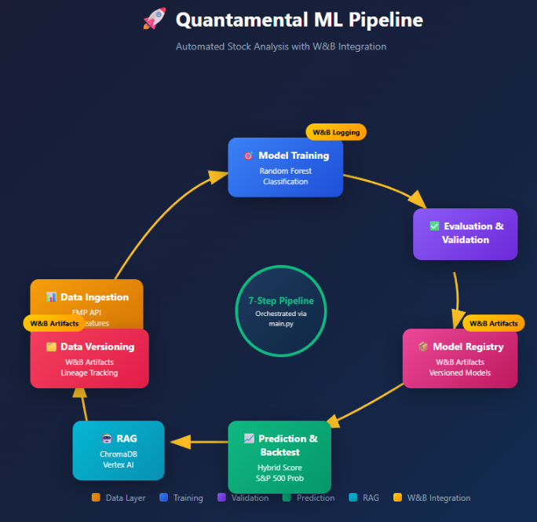
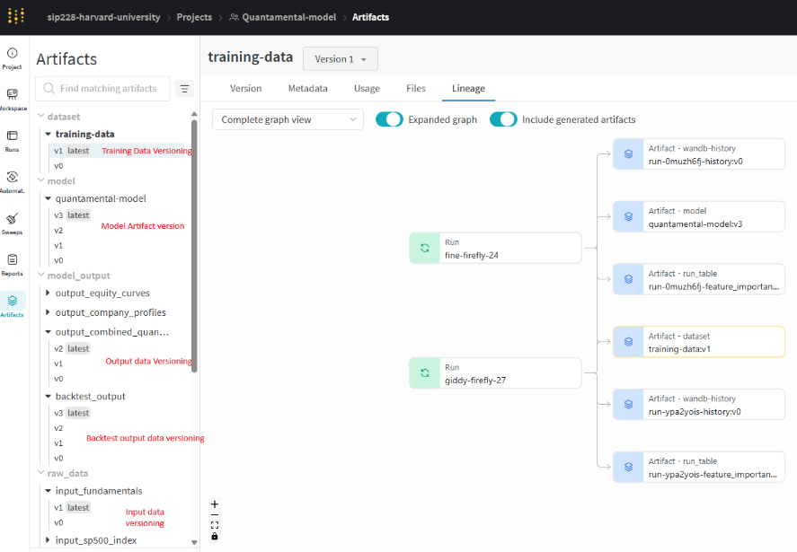

# Quantamental Stock Analysis Pipeline

**CSCI-E 115 / AC215 - Milestone 4**  
**Team: Stock Busters**  
**Author: Sirisom Pranivong**

---

##  Overview

The Quantamental Model is a machine learning pipeline that combines **fundamental analysis** (company financials) with **technical analysis** (market indicators) to predict which S&P 500 stocks are likely to outperform the market. The model generates a **Hybrid Score** that ranks stocks by their investment potential, with optional **RAG-powered reasoning** for explainable recommendations.

### Key Features

- **Data Collection**: Automated fetching from Financial Modeling Prep (FMP) API for 431 S&P 500 stocks
- **Feature Engineering**: 30+ technical and fundamental indicators
- **ML Model**: Random Forest Classifier for outperformance prediction
- **Model Validation**: Automatic quality thresholds (35% minimum, 80% production)
- **Hybrid Scoring**: Combined fundamental + technical scores for stock ranking
- **RAG Reasoning**: LLM-powered investment explanations using ChromaDB & Vertex AI
- **Experiment Tracking**: Full Weights & Biases (W&B) integration
- **Data Versioning**: W&B Artifacts + GCS timestamped outputs
- **CI/CD**: GitHub Actions with automated testing (51%+ coverage)

---

##  Pipeline Architecture

The pipeline is orchestrated through `main.py`, executing a **7-step workflow**:




### Pipeline Steps

| Step | Module | Description |
|------|--------|-------------|
| 1 | `data_collect.py` | Fetch OHLCV, fundamentals from FMP API |
| 2 | `data_process.py` | Feature engineering (30+ indicators) |
| 3 | `model_train.py` | Train Random Forest, log to W&B |
| 4 | `model_validation.py` | Quality gates (35%/80% thresholds) |
| 5 | `backtest.py` | Hybrid scoring, predictions, GCS upload |
| 6 | `generate_stock_reasoning.py` | RAG-powered explanations (optional) |
| 7 | `data_versioning.py` | Version artifacts to W&B |

---

##  Project Structure

```
src/quantamental/
├── __init__.py                 # Package initialization
├── config.yaml                 # Central configuration file
├── main.py                     # Pipeline orchestration (7 steps)
├── utils.py                    # Utilities (config loader, GCS handler)
├── data_collect.py             # FMP API data collection
├── data_process.py             # Feature engineering (30+ indicators)
├── data_versioning.py          # W&B Artifacts integration
├── model_train.py              # Random Forest training with W&B
├── model_predict.py            # Inference and predictions
├── model_validation.py         # Model quality validation (35%/80%)
├── backtest.py                 # Hybrid scoring and GCS upload
├── hybrid_scoring.py           # Fundamental + Technical scoring
├── generate_stock_reasoning.py # RAG-powered explanations
├── requirements.txt            # Python dependencies
├── Dockerfile                  # Container definition (Python 3.11)
├── pytest.ini                  # Test configuration
└── tests/                      # Test suite (51%+ coverage)
    ├── conftest.py             # Pytest fixtures
    ├── test_unit_*.py          # Unit tests (60+)
    ├── test_integration_*.py   # Integration tests (30+)
    ├── test_system_*.py        # System tests (5-10)
    ├── test_model_performance.py # Model validation tests
    └── README.md               # Test documentation
```

---

##  Quick Start

### Prerequisites

- Python 3.11+
- Docker (recommended)
- FMP API Key ([Get one here](https://financialmodelingprep.com/developer/docs/))
- W&B Account ([Sign up](https://wandb.ai/))
- GCP Service Account (for GCS and Vertex AI)

### Installation

**Option 1: Docker (Recommended)**

```bash
# Build container
docker build -t quantamental-dev .

# Run interactive shell
./docker-shell.sh
```

**Option 2: Local Installation**

```bash
# Create virtual environment
python -m venv venv
source venv/bin/activate  # Linux/Mac
# or: venv\Scripts\activate  # Windows

# Install dependencies
pip install -r requirements.txt

# Set environment variables
export FMP_API_KEY="your_fmp_api_key"
export WANDB_API_KEY="your_wandb_api_key"
export GOOGLE_APPLICATION_CREDENTIALS="path/to/gcs-credentials.json"
```

### Running the Pipeline

```bash
# Full pipeline (all 7 steps)
python main.py

# With RAG reasoning
python main.py --enable-rag --rag-sample 50

# Individual steps
python main.py --step collect    # 1. Data collection
python main.py --step process    # 2. Data processing
python main.py --step train      # 3. Model training
python main.py --step predict    # 4. Prediction
python main.py --step backtest   # 5. Backtest and upload
python main.py --step rag        # 6. RAG reasoning
python main.py --step version    # 7. Data versioning

# Skip specific steps
python main.py --skip-training   # Use existing model
python main.py --no-version      # Skip versioning
python main.py --force-refresh   # Force data refresh from API
```

---

##  Model Validation & Evaluation

### Validation Thresholds

The pipeline implements automated quality gates with three validation tiers:

| Status | Threshold | Action |
|--------|-----------|--------|
| 🟢 Production | ≥ 80% | Full deployment |
| 🟡 Degraded | ≥ 35% | Deploy with warnings |
| 🔴 Rejected | < 35% | Block deployment |

### Current Model Performance

| Metric | Value | Status |
|--------|-------|--------|
| **Accuracy** | 43.62% | ⚠️ Degraded |
| **Precision** | 44.60% | Below target |
| **Recall** | 27.19% | Below target |
| **F1-Score** | 33.79% | Below target |
| **ROC-AUC** | 40.29% | Moderate |
| **Validation Status** | Degraded | Monitoring required |

### How Validation Works

After each training run, the pipeline automatically evaluates model accuracy against the thresholds. If accuracy falls below 35%, the CI pipeline fails and blocks deployment. Models between 35-80% are flagged as "degraded" and deployed with warnings, while models above 80% are approved for full production deployment.

### CI Model Selection

Each model version is stored in W&B Artifacts with its accuracy and validation status. The CI pipeline queries all available versions, filters out rejected models, and automatically selects the highest-accuracy version for deployment. This ensures the best performing model is always in production, with full version history maintained for rollback if needed.

```
Push → Test → Train → Validate → Select Best Model → Deploy
                         │              │
                    Log to W&B    Compare versions
                                  (v0: 35% → v3: 44%)
```

### Why 35% Minimum Threshold?

The 35% threshold is intentionally set because:
1. **Stock prediction is inherently difficult** - even professionals struggle to beat the market consistently
2. **Above random chance has value** - probability scores enable ranking even with moderate accuracy
3. **Framework demonstration** - shows validation system works correctly
4. **Transparency** - honest about limitations rather than hiding them


---

##  RAG Integration

The pipeline generates **AI-powered investment reasoning** for each stock prediction using RAG (Retrieval-Augmented Generation).

### Components

| Component | Technology | Purpose |
|-----------|------------|---------|
| Vector Store | ChromaDB | Store embeddings of financial documents |
| Embeddings | FastEmbed (BAAI/bge-small-en-v1.5) | Convert text to vectors |
| LLM | Google Vertex AI (Gemini) | Generate reasoning |
| Framework | LangChain | Orchestrate RAG pipeline |

### Usage

```bash
# Add reasoning to output CSV
python main.py --enable-rag --rag-sample 50

# Run RAG step only
python main.py --step rag
```

### Output Example

The enhanced CSV includes a `reasoning` column:

```csv
symbol,prediction,probability,reasoning
NVDA,Outperform,0.78,"NVIDIA shows strong momentum with RSI at 65..."
AAPL,Outperform,0.75,"Apple's fundamentals indicate stable performance..."
```

---

##  Data Versioning

### Versioning Strategy

Data versioning is implemented through **W&B Artifacts** with supplementary storage in GCS:




**W&B Artifacts** (Primary):
- Raw data: `input_fundamentals:v0-v1`, `input_sp500_index:v0-v1`
- Training data: `training-data:v0-v1`
- Models: `quantamental-model:v0-v3`
- Outputs: `backtest_output:v0-v3`

**GCS Bucket** (Timestamped Backups):
- Files stored with timestamps: `combined_20251126_182206.csv`
- Location: `gs://fin-data-bucket-115/model_output/`

### Lineage Tracking

W&B automatically creates a lineage graph showing:
- Which data version trained which model
- Which config was used
- Parent-child relationships between artifacts

```
[training-data:v1] ──▶ [Run: giddy-firefly-27] ──▶ [quantamental-model:v3]
                                │
                                └──▶ [backtest_output:v3]
```

### Data Retrieval (Equivalent to `dvc pull`)

```python
import wandb
api = wandb.Api()

# Download latest model
artifact = api.artifact("Quantamental-model/quantamental-model:latest")
artifact.download()

# Download specific version
artifact_v2 = api.artifact("Quantamental-model/quantamental-model:v2")
artifact_v2.download("./models/v2")
```


---

##  Experiment Tracking (Weights & Biases)

All training runs are logged to [W&B](https://wandb.ai/sip228-harvard-university/Quantamental-model).

### Tracked Metrics

| Metric | Description | Logged At |
|--------|-------------|-----------|
| `accuracy` | Overall prediction accuracy | End of training |
| `precision` | Positive predictive value | End of training |
| `recall` | True positive rate | End of training |
| `f1_score` | Harmonic mean | End of training |
| `roc_auc` | Area under ROC curve | End of training |
| `validation_status` | Quality gate result | End of training |

### Logged Visualizations

- **Confusion Matrix**: True vs. predicted label distribution
- **Feature Importance**: Top 20 contributing features
- **Probability Distribution**: Model confidence histogram
- **ROC Curve**: Discrimination performance

### Model Artifacts

```
quantamental-model:v3
├── model.pkl          # Trained Random Forest
├── scaler.pkl         # Fitted StandardScaler
└── metadata
    ├── accuracy: 0.4362
    ├── validation_status: "degraded"
    └── training_date: "2025-11-26"
```

---

##  Testing

### Test Organization

| Type | Files | Tests | Coverage |
|------|-------|-------|----------|
| Unit | `test_unit_*.py` | 60+ | ~55% |
| Integration | `test_integration_*.py` | 30+ | ~45% |
| System | `test_system_*.py` | 5-10 | ~40% |
| Model Validation | `test_model_performance.py` | 10+ | Framework tests |
| **Total** | **12 files** | **90+** | **51%+** |

### Run Tests

```bash
# All tests with coverage
python -m pytest tests/ -v --cov=. --cov-report=term-missing

# Unit tests only (fast)
python -m pytest tests/test_unit_*.py -v

# Model validation tests
python -m pytest tests/test_model_performance.py -v
```

### Model Validation Tests

The `test_model_performance.py` demonstrates the validation framework:

```python
class TestModelValidationFramework:
    def test_framework_rejects_low_accuracy(self):
        """Framework correctly rejects models below threshold"""
        bad_model = {'accuracy': 0.30}
        with pytest.raises(AssertionError):
            assert bad_model['accuracy'] >= 0.35
    
    def test_framework_accepts_good_accuracy(self):
        """Framework accepts models above threshold"""
        good_model = {'accuracy': 0.85}
        assert good_model['accuracy'] >= 0.80
```

---

##  Output Files

### Local Output (`./data/`)

| File | Description |
|------|-------------|
| `combined_quantamental_hybrid_with_factors_and_backtest.csv` | Full predictions (40 columns) |
| `combined_..._with_reasoning.csv` | Predictions + RAG explanations |
| `company_profiles.csv` | Company metadata (372 companies) |
| `all_equity_curves.csv` | Performance tracking (100 stocks) |

### GCS Output (`gs://fin-data-bucket-115/model_output/`)

Files are uploaded with timestamps for versioning:

```
model_output/
├── combined_20251126_182206.csv
├── profiles_20251126_182206.csv
├── equity_20251126_182207.csv
└── ...
```

### Output Summary

```
✅ Stocks analyzed: 431
✅ Buy signals: 130
✅ Hold signals: 172
✅ Avoid signals: 129
✅ Output columns: 40 (exact match)
✅ GCS uploads: 3 files
✅ W&B artifacts: 6 versioned
```

---

##  CI Pipeline

### GitHub Actions Workflow

```yaml
on:
  push:
    branches: [main, Milestone4]

jobs:
  lint-and-test:
    steps:
      - Checkout code
      - Set up Python 3.11
      - Install dependencies
      - Lint with flake8
      - Run tests with coverage (≥50%)
      
  docker-build:
    needs: lint-and-test
    steps:
      - Build Docker image
```

### CI Pipeline Flow

```
Push → Lint → Test → Validate Model → Docker Build
                         │
              ┌──────────┼──────────┐
              ▼          ▼          ▼
           ≥80%       35-79%       <35%
        Production   Degraded    Rejected
         ✅ Pass     ⚠️ Warn     ❌ Fail
```


---

## ⚙️ Configuration

### config.yaml

```yaml
# Data settings
data:
  data_dir: "./data"
  start_date: "2022-11-27"
  end_date: "2025-11-26"

# Model hyperparameters
model:
  hyperparameters:
    n_estimators: 400
    max_depth: 8
    min_samples_split: 10
    min_samples_leaf: 5
    class_weight: balanced
    random_state: 42

# Validation thresholds
validation:
  prod_threshold: 0.80
  min_threshold: 0.35

# W&B settings
wandb:
  project: "Quantamental-model"

# GCS settings
gcs:
  bucket_name: "fin-data-bucket-115"
  output_folder: "model_output"
```

---

##  Known Limitations

### Current Model Accuracy (43.62%)

The model currently achieves 43.62% accuracy, which is below production threshold (80%) but above minimum (35%).

**Why?**
- Stock market prediction is inherently difficult
- Limited training data window (12 months)
- Feature engineering can be improved
- S&P 500 stocks are heavily analyzed by professionals

### Improvement Roadmap

| Phase | Target | Strategy |
|-------|--------|----------|
| **MS5** | 50% | Extended training window, feature selection |
| **MS6** | 65% | Ensemble methods, XGBoost/LightGBM |
| **Production** | 80% | Alternative data, deep learning, HPO |

### RAG Dependencies

RAG reasoning requires:
- Google Cloud credentials for Vertex AI
- ChromaDB vector store with financial documents
- Additional packages: langchain, chromadb, fastembed

---

##  Documentation

| Document | Description |
|----------|-------------|
| [QUANTAMENTAL_MODEL_COMPLETE.md](docs/QUANTAMENTAL_MODEL_COMPLETE.md) | Full technical documentation |

---


## Team

**Team Name**: Stock Busters  
**Author**: Sirisom Pranivong  
**Course**: Harvard CSCI-E 115 / AC215

---

**Last Updated**: November 2025  
**Version**: 1.0.0
